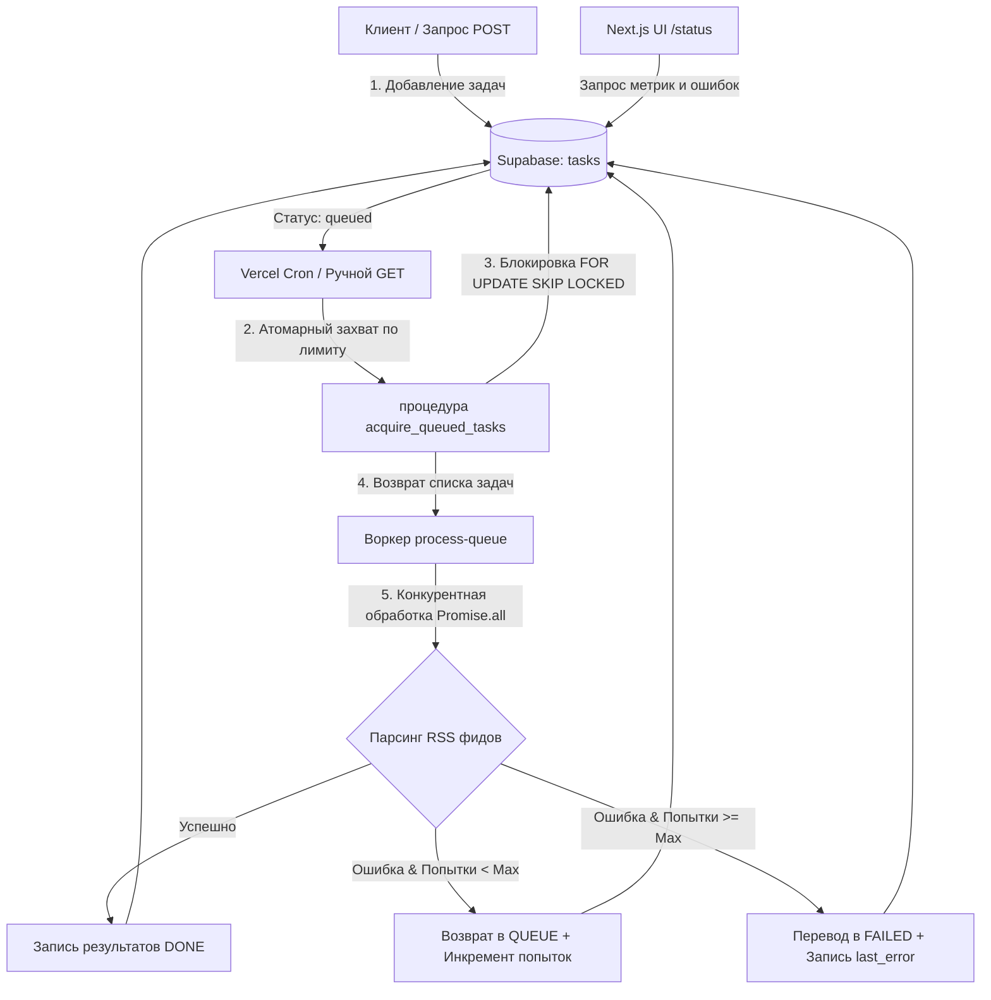

# Асинхронный конвейер обработки данных (RSS Feed Aggregator)

Асинхронный отказоустойчивый конвейер (pipeline) с очередью задач, автоматическими ретраями, идемпотентностью и панелью мониторинга. Проект спроектирован для развертывания на **100% бесплатном стеке**: **Supabase** (PostgreSQL) в качестве СУБД/очереди задач и **Vercel** (Next.js Serverless Functions + Cron Jobs) как исполнитель.

## Выбранная бизнес-логика
**RSS Feed Aggregator & Topic Monitor**: Каждая задача в очереди представляет собой задание на парсинг определенной публичной RSS-ленты (например, Hacker News, TechCrunch, BBC) по заданному списку ключевых слов (например, `python`, `ai`, `rust`). 
- В процессе работы воркер конкурентно скачивает XML-ленты, парсит их, фильтрует статьи по ключевым словам и записывает совпадения в `result` задачи.

---

## Архитектура и поток задач



### Гарантия Идемпотентности (Изоляция Race Conditions)
Для того чтобы параллельно запущенные инстансы воркеров не хватали одну и ту же задачу дважды, выборка и перевод статуса в `processing` происходят атомарно на уровне СУБД. В миграции создается функция `acquire_queued_tasks`, использующая возможности PostgreSQL по блокировке строк:
```sql
WITH selected_tasks AS (
  SELECT id FROM tasks
  WHERE status = 'queued'
  ORDER BY created_at ASC
  LIMIT max_tasks
  FOR UPDATE SKIP LOCKED -- Блокирует выбранные строки и пропускает уже заблокированные
)
UPDATE tasks
SET status = 'processing', updated_at = NOW()
WHERE id IN (SELECT id FROM selected_tasks)
RETURNING *;
```

---

## Структура проекта

* `core/` — **Источник истины: Python-ядро**. Чистая логика переходов автомата состояний (`state_machine.py`) и изолированные юнит-тесты на `pytest` (включая симуляцию конкурентного захвата и ретраев). Показывает алгоритмическую базу отдельно от Next.js обвязки.
* `app/api/` — Next.js Route Handlers (эндпоинты):
  * `POST /api/tasks` — добавление задач в очередь.
  * `GET /api/process-queue` — выполнение воркера (вызывается кроном или вручную).
  * `GET /api/metrics` — статистика по статусам, сбоям и скорости работы.
  * `POST /api/tasks/retry` — сброс задачи в статус `queued` для ручного перезапуска.
* `app/status/` — Панель мониторинга на Next.js (Client Component), написанная на **чистом Vanilla CSS** (CSS Modules), с автообновлением, графиком статусов, логом последних 10 ошибок и кнопками управления.
* `lib/` — вспомогательные TypeScript-модули (клиент Supabase, логика захвата задач в БД, RSS-парсер с таймаутом).
* `supabase/migrations/` — SQL-миграция для развертывания структуры БД и функций в Supabase.

---

## Настройка и локальный запуск

### 1. Подготовка Базы Данных (Supabase)
1. Создайте бесплатный проект на [Supabase](https://supabase.com/).
2. Перейдите в раздел **SQL Editor** и выполните код из файла:
   [`supabase/migrations/001_create_tasks_table.sql`](file:///d:/Projects/ASYNC/supabase/migrations/001_create_tasks_table.sql).
   *Этот скрипт создаст таблицу `tasks`, необходимые индексы, триггер для `updated_at`, настроит RLS-политики доступа и функцию `acquire_queued_tasks`*.

### 2. Конфигурация окружения
Создайте файл `.env` в корневом каталоге проекта на основе шаблона [`.env.example`](file:///d:/Projects/ASYNC/.env.example):
```bash
NEXT_PUBLIC_SUPABASE_URL=https://your-project.supabase.co
SUPABASE_SERVICE_ROLE_KEY=your-service-role-key-from-supabase
QUEUE_SECRET_TOKEN=local-dev-secret
CRON_SECRET=local-dev-secret
```
> [!IMPORTANT]
> Используйте именно `SUPABASE_SERVICE_ROLE_KEY` (а не анонимный `anon` ключ), поскольку в базе включен RLS (Row Level Security), и только бэкенд с правами сервисной роли имеет доступ к таблице задач.

### 3. Установка и запуск Next.js (Фронтенд + API)
```bash
# Установка JS зависимостей
npm install

# Запуск локального сервера разработки
npm run dev
```
Откройте в браузере страницу **[http://localhost:3000/status](http://localhost:3000/status)**, где отобразится панель мониторинга.

### 4. Запуск Python-тестов ядра
Для тестирования логики переходов состояний и идемпотентности воспользуйтесь Python (требуется установленный `pytest` и `pytest-asyncio`):
```bash
# Установка pytest зависимостей
pip install pytest pytest-asyncio

# Запуск тестов
python -m pytest core/tests/
```

---

## Деплой на Vercel и настройка Vercel Cron

### 1. Деплой
Импортируйте проект в Vercel. Добавьте в настройках проекта Vercel (Environment Variables) четыре переменные из вашего `.env`.

### 2. Ограничения Vercel Cron на Hobby (бесплатном) тарифе
На бесплатном тарифе Hobby лимит для Vercel Cron составляет **1 запуск в день**. 
- Конфигурация в [`vercel.json`](file:///d:/Projects/ASYNC/vercel.json) настроена на ежедневный запуск в полночь (`0 0 * * *`), что проходит валидацию Vercel при деплое.
- **Воркер-фоллбэк для частого запуска:** Для обхода этого ограничения в эндпоинте `/api/process-queue` реализован фоллбэк авторизации. Вы можете вызывать обработчик очереди с любой частотой (например, раз в минуту) через внешние планировщики (GitHub Actions, UptimeRobot и т.п.) по URL:
  `https://your-app.vercel.app/api/process-queue?secret=YOUR_QUEUE_SECRET_TOKEN`

---

## CI/CD Конвейер

В проекте настроен GitHub Actions рабочий процесс в [`.github/workflows/ci.yml`](file:///d:/Projects/ASYNC/.github/workflows/ci.yml). При каждом коммите в ветки `main`/`dev`/`feature/*` автоматически запускаются:
1. Тесты Python ядра с помощью `pytest`.
2. Линтер Next.js проекта `npm run lint`.
3. Тестовая сборка Next.js проекта `npm run build` для проверки отсутствия ошибок типизации TypeScript и компиляции.
